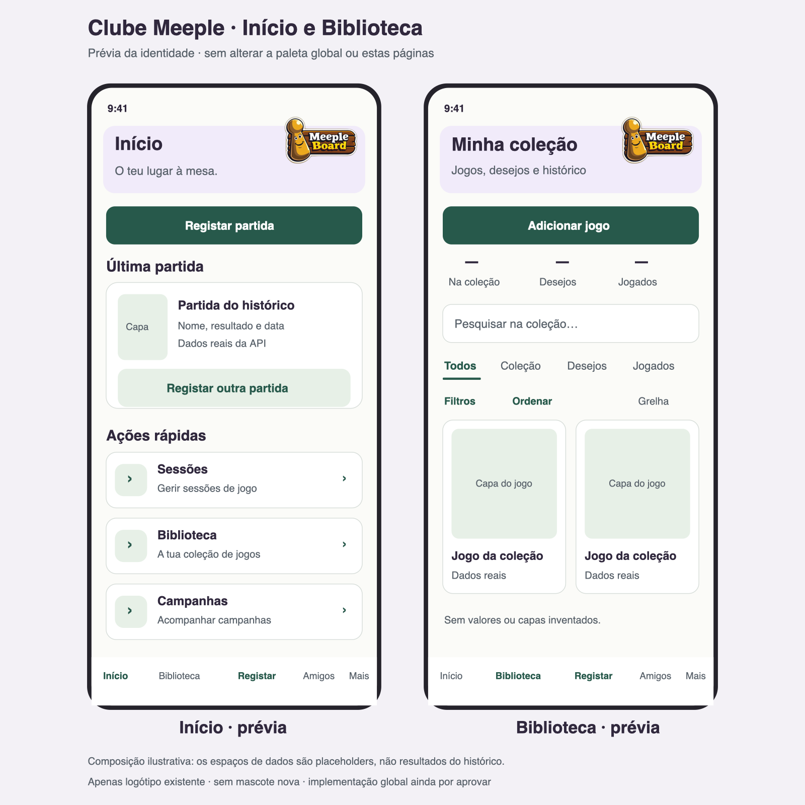

# Afinação de autenticação — Clube Meeple

## Aprovação da direção visual

O utilizador confirmou satisfação com a direção visual atual no iPhone; conservar esta versão como base. A aprovação visual não encerra os percursos funcionais de autenticação nem todos os testes de acessibilidade/teclado. Ver o estado mais recente em `pendencias-funcionais.md`.

## Afinação final: composição centrada

O logótipo centra-se na largura total do cabeçalho nos seis ecrãs, incluindo Boas-vindas e confirmação de email sem botão de regresso. Voltar/Cancelar continua à esquerda e dado/meeple à direita, numa camada independente. Se a largura disponível não comportar as três zonas (considerando fontScale), os formulários passam os controlos para uma linha abaixo do logótipo; não se corta o logótipo. Com texto ampliado/ecrã baixo conserva-se o logótipo e recolhe-se a decoração. Com teclado aberto recolhem-se ambos, conservando regresso, título e campos. Não se altera a ação nem a proteção de saída.

Títulos 22/30, peso 700 (antes 24/32, 800), sem limite de ampliação/linhas. Início do formulário a 14 pt. Documentos das Boas-vindas ficam depois de Entrar/Criar conta, numa linha com quebra automática e áreas de toque mínimas de 44 pt; URLs, textos e traduções inalterados. Recuperação, confirmação de email e nova palavra-passe usam o mesmo cabeçalho partilhado.

Validação: Node 22.14.0, TypeScript, 238 testes (30 autenticação), exportação iOS `.expo/auth-final-ios-export` ignorada, bundle iOS HTTP 200 em Expo 8082. API confirmou DeviceTests / MeepleBoard_DeviceTests / externalDelivery=false. Sem alterações de API, dados ou tema global. As verificações estruturais cobrem centragem independente e adaptação a 320 pt/fontScale 2 nos seis ecrãs; não comprovam a geometria nativa.

Resultado real disponível no Expo 8082. Este Mac só tem CommandLineTools, sem simulador iOS/Xcode completo: não foi possível obter captura nativa. Comparação visual final permanece pendente no iPhone, sem substituir uma captura por mockup. Confirmar Boas-vindas/Entrada/Registo sem teclado; teclado no último campo; texto ampliado; recuperação e estados de confirmação de email/nova palavra-passe com ligações de testes válidas/expiradas. Manter testes Solo/coop pendentes e restantes etapas sem implementação.

## Recuperação da personalidade do mockup B

A comparação com `b-clube-meeple.png` identificou detalhes retirados em excesso: dados/meeples e curva suave, em vez dos dois pequenos círculos e canto arredondado isolado. Recuperados no `AuthPlayfulDetails`: dado do conjunto de ícones existente e meeple genérico sem rosto, construído com formas nativas. Não são personagens nem mascotes. Grupo de 68 × 40 pt dentro da linha do logótipo (68 pt): não acrescenta altura. Curva elíptica absoluta revela apenas 10 pt dentro da margem inferior existente, sem deslocar o formulário. Todos os elementos decorativos são inacessíveis ao leitor de ecrã e não interceptam toques.

Diferenças intencionais face ao mockup: logótipo menor e cabeçalho compacto após avaliação real no iPhone; fantasma excluído por ser placeholder; meeple/dado concentrados no cabeçalho em vez da decoração grande no rodapé; requisitos completos de palavra-passe e textos legais mantidos, sem encurtar para reproduzir uma imagem. Campos, bordos finos, interruptores, Criar conta, Voltar/Cancelar e proteções continuam iguais à afinação anterior. Tema global não alterado.

A decoração inteira e a curva recolhem com teclado aberto, ecrã baixo ou texto ampliado. Não foram recriados o fantasma, um novo asset de mascote ou o rodapé decorativo grande. Dados/meeple/curva eram as omissões gráficas deste pedido e foram implementados; a aproximação visual de posição/peso/equilíbrio ainda exige confirmação no iPhone. Mockup estático não é especificação de geometria nativa. Percurso: comparar Entrada/Registo sem teclado; focar último campo e percorrer mensagens/botão; ampliar texto; confirmar que a decoração desaparece sem afetar os valores ou navegação.

Implementação restrita à autenticação; validação visual final no iPhone pendente. API 5099 e Expo 8082 exclusivamente em DeviceTests. Sem migração, credenciais versionadas ou alterações na base habitual.

## Causas e decisões

O cabeçalho combinava viewport do logótipo com 88 pt, placeholder de 116 pt e várias margens. Essa soma dava demasiada prioridade à decoração. O logótipo usa agora 104 × 68 pt (antes 132 × 88); deixou de haver personagem no cabeçalho. Título 24/32 (antes 26/34), subtítulo 16/24, margens verticais menores e detalhes discretos de tabuleiro (dado/meeple na atualização acima). Tipografia continua ampliável: sem limitar número de linhas, sem reduzir automaticamente a letra ou tentar forçar tudo num ecrã.

`assets/animations/ghost.json` foi incorretamente classificado como mascote na etapa anterior. O utilizador confirmou que é um placeholder; os usos originais em DashboardScreen e GameSelector mantêm-se e os respectivos ficheiros/asset não foram alterados. Não foi encontrado um ficheiro confirmado da mascote verdadeira. Nenhuma personagem foi criada ou substituída; usar apenas o logótipo existente.

Campos com bordo de 1 pt (antes 2), contraste e foco verde mantidos; altura mínima 52, rótulos 16/24, alvos de 44. Ritmo entre grupos de 14 pt e início do formulário a 16 pt: mantém espaço para ler sem acrescentar cartões/margens excessivas.

Nos interruptores, `trackColor.false` sozinho não define consistentemente o fundo desligado do UISwitch: agora `ios_backgroundColor` indica explicitamente o cinzento escuro desligado, verde escuro para ligado e polegar branco contrastante em ambos. Posição do polegar e estado checked acessível distinguem as opções; valores por defeito e handlers mantidos.

Entrada ganhou «Ainda não tens conta? Criar conta» (PT/EN), com push para o registo. Com campos preenchidos, esse acesso usa a confirmação de descarte existente: Continuar a editar conserva os valores e só Descartar e sair permite mudar de percurso. Sem valores/operação, abre diretamente o registo. Não se acrescenta persistência de palavras-passe. A ação fica indisponível durante login/reenvio em curso. Boas-vindas descreve pesquisa/coleção/partidas/sessões/campanhas; não promete conversas ou mensagens.

## Navegação e teclado

Voltar quando o formulário está vazio, sem operação em curso; Cancelar quando há valores/consentimento alterados ou operação em curso. As ações continuam ligadas aos mesmos hooks/guards: não se muda a confirmação de descarte, prevenção de saída ou destinos. O rótulo acessível corresponde à ação; na confirmação de email conservam-se os rótulos/destinos existentes.

Com teclado aberto, ecrã baixo ou texto ampliado, recolhem-se logótipo, dado/meeple e curva; título e formulário permanecem. O campo ativo é reposicionado depois do teclado/layout, sem limpar valores. Mensagens e botões mantêm-se no fluxo rolável e podem ser alcançados acima do teclado; nenhuma barra flutuante sobrepõe campos. Mantidos autofill, campos seguros, mostrar/ocultar, mensagens, cooldown, termos e regras de palavras-passe. A divergência cliente/Identity já registada não foi corrigida nesta tarefa visual.

## Prévia da identidade no Início e Biblioteca

[SVG original](mockups/autenticacao/previa-inicio-biblioteca.svg). É uma composição estática para comparar a direção visual **antes** de alterar a paleta global; não é uma captura da aplicação. Mantém ação Registar, última partida e acessos a Sessões/Biblioteca/Campanhas, mais coleção, pesquisa, filtros e ordenação. Os espaços de capas/dados e «—» são placeholders explícitos de layout, não resultados nem valores históricos. Nenhum dado pessoal, nome de amigo, resultado, despesa ou capa foi inventado. Os ecrãs reais e o tema global permanecem inalterados.

## Verificação e percurso nativo

Node 22.14.0, TypeScript, 237 testes frontend (29 de autenticação), incluindo destinos/contratos PT/EN, navegação Voltar/Cancelar, confirmação de descarte antes de abrir registo e preservação ao escolher continuar a editar, indisponibilidade durante operação, estados do UISwitch e contraste. Exportação iOS concluída em `.expo/auth-playful-ios-export` (ignorada) e bundle iOS HTTP 200 no Expo 8082; saúde da API confirmou DeviceTests/MeepleBoard_DeviceTests/externalDelivery=false. Recolha decorativa e scroll verificados com teclado simulado, largura 320 e texto ampliado; estes testes não demonstram a geometria nativa.

No iPhone: recarregar Expo, terminar sessão de testes, abrir Entrada e observar cabeçalho/bordos. Manter sessão iniciada: alternar ligado/desligado. Criar conta a partir da Entrada; preencher alguns campos, abrir teclado no último e alternar mostrar/ocultar; rolar até termos/botão e verificar mensagens. Cancelar → continuar a editar deve conservar os valores; abandonar deliberadamente regressa ao contexto anterior. Formulários vazios mostram Voltar. Repetir com texto ampliado e testar login com a conta fictícia existente. Não usar dados reais nem contas/email pessoais.

Confirmação visual/funcional no iPhone pendente. Os testes Solo/coop pendentes mantêm-se; Estatísticas e retrospetiva não foram implementadas. A prévia global não autoriza nem representa mudança na paleta global.
