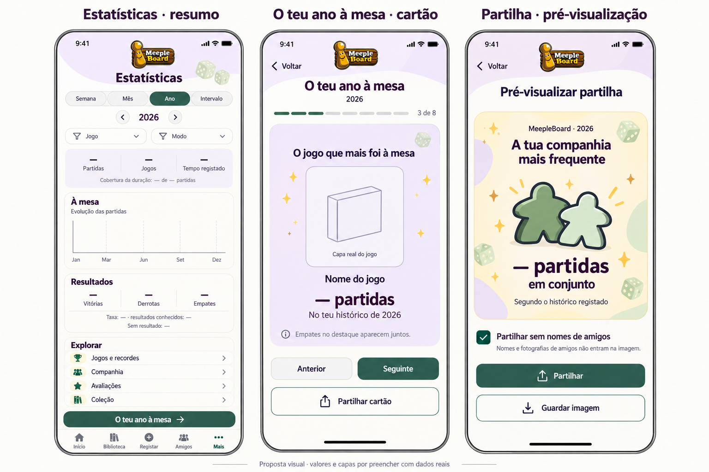

# Estatísticas e «O teu ano à mesa» — proposta atual

Estado: Início/Biblioteca e controlos testados aprovados no iPhone; manter identidade Clube Meeple. Só análise, documentação e mockups nesta etapa; implementação por fases após aprovação. Sem consultas/escritas na base habitual ou alterações de contratos/código/migrações. Jogar novamente com jogo pré-selecionado continua pendente; não clonar partidas.

## Mockup ilustrativo

Gerado com ferramenta image_gen incorporada, logótipo existente como referência. [Prompt](mockups/estatisticas/prompt.txt). Valores/capas por preencher com dados reais; não são capturas nem indicadores calculados.

## Estrutura e composição

Acesso proposto em Mais → Estatísticas, com atalho a partir do perfil. Não substituir nenhum dos cinco separadores nem qualquer acesso existente. Cabeçalho compacto com logótipo centrado. Lavanda #F1EBFA, verde #27594B, branco quente #FBFBF8, texto #30283D e dourado #F5BE32 nas avaliações/detalhes, conservando cores semânticas de estado. Capas reais em contain e fallback neutro; sem nova mascote nem decoração com ghost.json.

Resumo: Semana/Mês/Ano/Intervalo, período e anterior/seguinte, filtros opcionais jogo/modo. Partidas, jogos distintos e tempo registado com cobertura junto ao valor; evolução temporal simples. Resultados próprios com vitórias/derrotas/empates, taxa e número de resultados conhecidos; quantidade sem resultado e origem legada visíveis. Explorar por secções, sem despejar todos os gráficos no ecrã inicial:

1. À mesa: atividade, jogos mais jogados, tempo conhecido e evolução.
2. Resultados: vitórias/derrotas/empates, taxas por jogo e modo, jogos com mais vitórias.
3. Jogos e recordes: frequência, pontuações pessoais comparáveis e primeira partida registada.
4. Companhia: pessoas com quem mais joguei, jogos e resultados conjuntos autorizados.
5. Avaliações: minhas avaliações, média por jogo e evolução, incluindo zero/meios pontos.
6. Coleção: jogos atuais, desejos, sem partidas registadas, preços registados e cobertura; aquisição/despesas temporais só quando houver dados próprios.

Cada indicador abre partidas/entradas que o sustentam, com filtros preservados. Títulos suaves 22/30, corpo 16/24, ações ≥44 pt, margens 16–20 e pouca sombra. Grelhas passam a uma coluna com texto ampliado. Gráficos têm alternativa textual/tabular e rótulos acessíveis; não dependem só da cor. Estados de zero atividade, dados insuficientes, erro/repetição e carregamento distintos. Recolher decoração ao abrir seletores/teclado, sem encurtar texto.

## O que existe no contrato e o que falta

A tabela distingue dados já guardados de endpoints prontos para a nova página. Não é necessário guardar novas partidas para calcular os indicadores básicos, mas precisamos de agregações autorizadas sobre o universo completo: as páginas de histórico não representam necessariamente esse universo.

| Indicador | Dados disponíveis | Alteração necessária / limite |
| --- | --- | --- |
| Partidas e jogos distintos | MatchDate, GameId, MatchPlayers | Novo endpoint por período/fuso e participação; distinct MatchId/GameId. Catálogo/expansões/variantes não devem ser fundidos por nome. |
| Tempo total, médio e por jogo | DurationInMinutes nullable | Agregar minutos conhecidos e devolver partidas com/sem duração. TotalHoursPlayed da biblioteca é inteiro desnormalizado e não substitui a duração original. Sem duração conhecida, indisponível. |
| Jogos mais jogados / evolução / mês mais ativo | Datas, GameId, capa/nome | Agrupar por ID, série temporal e drilldown. GetMostPlayedGamesByUserAsync atual agrupa por nome: não reutilizar como identidade canónica. |
| Vitórias, derrotas, empates e taxas | GameMode, Result e Outcome por participante já implementados | Extender agregações atuais com período/jogo/modo e cobertura; preservar o resultado do próprio jogador. Sem migração de resultados nesta etapa. |
| Jogos com mais vitórias / maior taxa | Outcome Win e conhecidos Win/Loss/Draw | Rankings distintos com amostra; proposta de mínimo 5 resultados conhecidos para destaque por taxa, ajustável e transparente. Mostrar também jogos abaixo desse mínimo sem os coroar líderes. Não comparar modos como se fossem equivalentes. |
| Companhia / resultados conjuntos | Coparticipação e resultados explícitos | Agregar cada par uma vez por MatchId, respeitar autorização antes de agrupar e expor só identidade permitida. Histórico conjunto já tem modos/resultados, mas soma duração sem cobertura. |
| Avaliação pessoal e jogos mais bem avaliados | MatchJournalEntry.PersonalRating nullable 0–10 em meios pontos | Query deve selecionar apenas JournalEntry do utilizador autenticado. Match.PersonalRating é cópia legada de conveniência e o mapper geral ainda a expõe; não a usar como avaliação de cada participante. Devolver n/avaliadas e cobertura; ausência não é zero. Legado arredondado não recupera meios pontos perdidos. |
| Pontuações/recordes | MatchPlayer.Score inteiro nullable com sinal | Pode mostrar pontuação máxima e mínima registada, incluindo 0/negativos; não chamar máximo «melhor». Novo metadado para sentido maior/menor/não comparável, unidade, variante/versão/condições e comparabilidade por partida; guardar contexto para alterações futuras. Sem inferir do catálogo/resultados. |
| Primeiras experiências | Primeira MatchDate por utilizador/GameId | Consultar histórico anterior ao período; «pela primeira vez no teu histórico registado», nunca primeira vez na vida. |
| Tenho sem partidas registadas | Biblioteca Owned e participação histórica | Anti-join com partidas próprias completas; coleção atual, não posse histórica. Evitar expressão «nunca jogaste». |
| Entradas adicionadas à coleção | AddedAt e estado atual | Pode contar entradas atuais adicionadas no período, não «compras». Remoções/alterações não preservam uma linha temporal completa. |
| Preços/despesas/aquisições | PricePaid decimal nullable, AddedAt | Mostrar preços registados nas entradas atuais, com n de preços conhecidos; 0 válido. Data de compra, moeda e eventos de aquisição/remoção/preço exigem novo contrato/armazenamento. Frontend formata EUR, mas moeda não é guardada: não declarar despesa anual/multi-moeda fiável nem assumir preço ausente=0. Não preencher datas históricas por AddedAt. |

Outras métricas úteis, secundárias: dias com partidas, meses ativos, média de partidas por semana (semanas do intervalo indicadas), variedade, jogos retomados e percentagem da coleção atual com partidas registadas. Cobertura dos dados é transversal. Evitar competição social, sequências artificiais e somar percentagens como se fossem contagens.

## Regras de cálculo

Período definido no fuso selecionado (por defeito dispositivo, nome visível), semana segunda–domingo; converter início e fim locais para UTC e usar fim exclusivo, inclusive transições de horário de verão. Por defeito ano atual. Não comparar mês/ano parcial com período completo sem indicar cortes equivalentes. Datas antigas sem offset seguro permanecem com limite de precisão indicado, não deslocadas por suposição.

Partida contada uma vez para o próprio utilizador. Resultado por Outcome do jogador, coerente com modo/resultado explícitos. Competitivo: cada vencedor Win (vitória partilhada não divide uma vitória em frações); empatados em primeiro Draw, restantes Loss. Solo: resultado do único jogador. Cooperativo: resultado da equipa aplicado a cada participante, rotulado como equipa e separado por modo. Não inventar oponente «jogo» nem deduzir resultados por pontuações. Modo ausente permanece «modo não registado», sem classificação pelo catálogo; pode entrar na atividade total, mas não em taxas de um modo presumido.

Taxa = vitórias / (vitórias + derrotas + empates); excluir Undefined/null, mostrar denominador e número sem resultado. Sem resultados conhecidos, taxa indisponível, não 0%. Uma partida com resultado conhecido mas nome do vencedor oculto continua conhecida. Separar «resultado não definido» explícito de «legado ambíguo», preservar informação original; WinnerId/IsWinner de legado podem ser mostrados como informação original, sem preencher derrotas/empates ou reclassificar pelo catálogo. Mostrar origem/cobertura e não adicionar legado incerto aos denominadores como se fosse explícito. Os resultados já classificados atualmente por Outcome continuam a fonte dos cálculos existentes.

Duração: somar valores existentes, com n/n total junto ao tempo; null excluído, 0 explícito preservado e não equivalente a ausência. Não substituir pela duração típica do catálogo, não somar tempo por participante. Avaliação: apenas minha JournalEntry, média entre valores definidos (inclui 0 e 7,5), n de avaliações exibido. Empates nos rankings/destaques apresentados juntos, sem desempate silencioso por nome. Quando houver muitas igualdades, cartão conjunto/lista de líderes.

Recordes: permitir leitura de pontuações antigas incompletas, não preencher campos. Sem sentido/comparabilidade, mostrar apenas máximos/mínimos registados; evolução numérica não implica evolução de desempenho. Comparações por jogo/modo/configuração, com número de pontuações disponíveis; jogos que premiam menor pontuação exigem regra explícita.

## Retrospetiva anual

Acesso dentro de Estatísticas; ano selecionável, incluindo anos anteriores. Cartões com capa/nome e um destaque por vez, progressão e botões Anterior/Seguinte, swipe opcional, movimento reduzido e alternativa textual. Sequência proposta (número efetivo adapta-se à disponibilidade):

1. O teu ano à mesa: ano e partidas/jogos registados.
2. Jogo(s) mais jogado(s): n partidas por líder.
3. Jogo(s) com mais vitórias: n vitórias, n com resultado conhecido, modo. Maior taxa é outro destaque opcional, com mínimo/amostra explícitos.
4. Companhia mais frequente: n partidas conjuntas autorizadas; sem nomes no export por defeito.
5. Tempo registado: soma parcial e cobertura; sem durações, cartão explica indisponibilidade ou é omitido de forma explícita.
6. Mês mais ativo: n partidas e mês/fuso; mostrar líderes empatados.
7. Jogos experimentados pela primeira vez segundo o histórico: n e capas reais; consultar anteriores ao ano.
8. Encerramento: resumo e escolher cartões para partilhar.

Ano vazio: mensagem acolhedora e escolher outro ano, sem preencher histórias fictícias. Dados insuficientes não produzem recordes ou vencedores artificiais. Revisões futuras dos dados recalculam o resumo; não congelar uma snapshot histórica sem versão/data e sem nova autorização de privacidade.

## Privacidade e partilha

Endpoint usa utilizador autenticado, sem permitir agregações arbitrárias de terceiros pelo ID. Universo de partidas/participações autorizado antes da agregação. LibraryPrivacy (Public/FriendsOnly/Private) não autoriza automaticamente notas, avaliações ou histórico de outro jogador; PricePaid já é removido para terceiros no contrato atual. Não reutilizar UserDto que contém email como resposta de estatísticas. DTO mínimo dedicado, sem notas/tags/localizações/fotografias privadas/tokens.

Consulta privada pode mostrar companheiros apenas conforme permissões atuais. Partilha predefinida sem nomes, avatares nem identificadores de amigos, mantendo só o total autorizado. Proposta: nomes de terceiros nunca no export da primeira fase; não basta um interruptor meu para consentir em nome do amigo. Sem resultados individuais/pontuações de terceiros no cartão público. Preview mostra exatamente a imagem exportada, pode escolher cartões e omitir companhia por completo. Rever payload/metadados, thumbnails e nomes de ficheiro; não enviar campos privados escondidos que só o frontend remove visualmente. Preferir geração local sem criar link público ou publicar automaticamente; share sheet nativa ou guardar imagem após ação explícita. Coberturas e amostras permanecem nos cartões partilhados para evitar alegações enganadoras.

## Fases propostas

1. Contratos/agregação de base: períodos/fuso, resumo, cobertura, resultados por modo, testes fronteiras UTC/DST, desconhecidos, legado, empate parcial/vitória partilhada/Solo/cooperativo, autorização. Usar apenas DeviceTests; sem novos campos para estes indicadores.
2. Estatísticas: resumo + À mesa/Resultados + jogos mais jogados e evolução; drilldown, filtros persistentes, erros/vazios e acessibilidade. Aprovar no iPhone antes de expandir.
3. Explorar: companhia autorizada, avaliações próprias e coleção atual; pontuações apresentadas descritivamente enquanto comparabilidade não definida. Campos de aquisição/moeda/variantes e recordes entram numa etapa funcional separada com proposta/migração explícita.
4. Retrospetiva: reutilizar as mesmas agregações, primeiras experiências no histórico completo e líderes empatados; percorrer cartões, ano vazio e cobertura. Primeiro validar leitura privada.
5. Partilha: export local, preview sanitizada, sem nomes de amigos, acessibilidade/movimento reduzido e validação de dados que ficam no ficheiro.

Solo empate/resultado não definido, cooperativo e campanhas/encontros permanecem pendentes no iPhone; a análise de código não fecha esses percursos. A01–A08 e restantes fluxos de autenticação não se consideram integralmente validados. Jogar novamente permanece pendente.

## Evidência de código consultada

- MatchDto / MatchPlayerDto: modo, resultado, ResultSource, Score nullable e DurationInMinutes nullable.
- MatchOutcomeRules: resolver explícito; nenhuma inferência nos leitores de legado.
- UserService.PopulateResultStatistics e MatchPlayerRepository: Outcome e denominador conhecido já implementados. Métodos por período usam atualmente fim inclusivo: novo contrato deve normalizar fim exclusivo.
- MatchPlayerRepository.GetMostPlayedGamesByUserAsync: agrupa por nome.
- FriendshipRepository: resultados explícitos conjuntos, duração sum(DurationInMinutes ?? 0) sem cobertura.
- MatchJournalEntry e MappingEntityToDto: diário por pessoa versus cópia de conveniência no MatchDto.
- UserGameLibrary/Dto: AddedAt, PricePaid nullable, counters inteiros, sem moeda/data de compra/eventos.
- Game: sem sentido/unidade/variante de pontuação comparável guardados.
- MatchController.GetAll: histórico paginado; evitar calcular totais anuais a partir de uma página.

Inspeção de código/documentação; nenhum teste de novo endpoint executado porque ainda não há implementação. Mockup ilustrativo, não captura; o visto de privacidade no preview deve ser uma garantia fixa na primeira fase, não um controlo que permite revelar nomes. Valores «—», área de gráfico vazia e capa neutra são placeholders explícitos.
