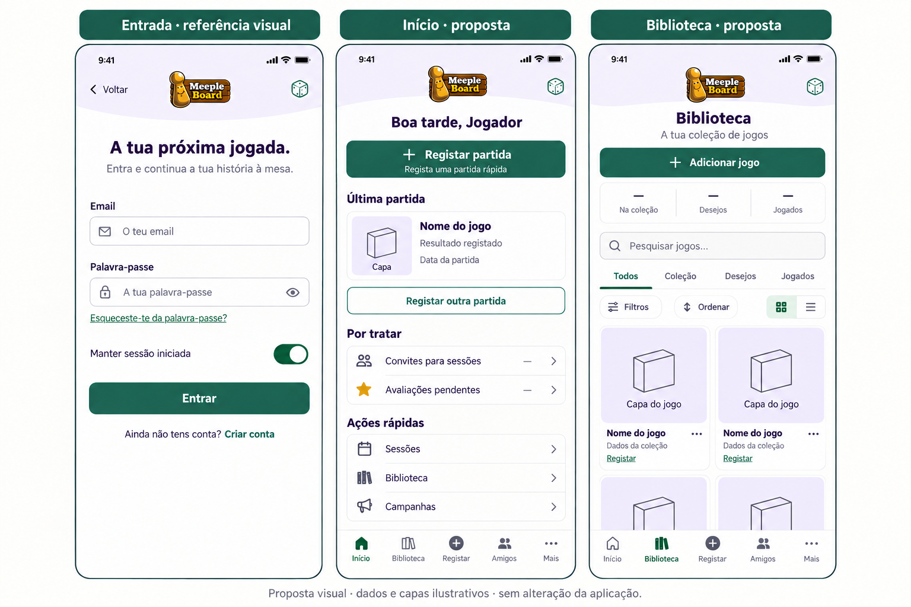

# Identidade MeepleBoard — Entrada, Início e Biblioteca

Estado atualizado: proposta aprovada e aplicada apenas ao Início/Biblioteca; ver `implementacao-inicio-biblioteca-clube.md`. Os parágrafos seguintes conservam a proposta original. Autenticação atual aprovada como base visual, sem declarar todos os fluxos validados. Somente documentação e mockup, sem alterar tema global, componentes, dados, contratos ou a base habitual.

## Mockup para comparação

Gerado com a ferramenta incorporada image_gen; prompt e refinamento em `mockups/autenticacao/identidade-inicio-biblioteca-prompt.txt`. Imagem ilustrativa, não captura da aplicação. Os recortes não mostram todos os estados/ações condicionais.

## Composição e identidade

Lavanda #F1EBFA em cabeçalhos compactos, branco quente #FBFBF8 no fundo, verde #27594B em ações/foco, texto #30283D e secundário #58616A. Dourado nos ícones de avaliação e pequenos detalhes; nunca único indicador de resultado, nem cor de texto de baixo contraste. Conservar cores semânticas de estados/erros/resultados. Logótipo existente pequeno; dados/meeples genéricos sem criar mascote nem usar ghost.json como decoração. Bordas finas, pouca sombra, títulos 22/30 e corpo 16/24 como referência, sem bloquear ampliação. A curva aparece apenas no cabeçalho, sem repetir molduras.

Entrada serve de referência à implementação aprovada, não de nova proposta de autenticação. O mockup é uma composição ilustrativa, não captura nativa; o texto fiel da aplicação e as traduções prevalecem sobre qualquer aproximação da imagem gerada.

Início organiza ações: saudação real, Registar partida em primeiro plano, última partida com capa e leitura do resultado/data existente, Registar outra partida secundário. Por tratar só aparece quando há convites/diário pendentes. Sessões, Biblioteca e Campanhas continuam acessíveis e com os destinos atuais. Não acrescentar métricas fictícias, estatísticas futuras ou navegação ao detalhe onde o ecrã atual não tem essa ação.

Biblioteca organiza exploração: Adicionar jogo, resumo de coleção/desejos/jogados, pesquisa, separadores Todos/Coleção/Desejos/Jogados, filtros/ordenação e alternância grelha/lista. Capas dominam os cartões com imagem em contain, proporções preservadas e fallback neutro ao faltar/falhar imagem. Detalhes do jogo, ação atual da entrada, menu e gestão por toque prolongado mantêm-se. A grelha usa duas colunas apenas quando largura/texto permitem; texto ampliado/ecrã estreito passa a uma. Custos continuam condicionados ao separador Coleção. Destaque atual, respetivas ações/dispensa e condições conservados, mesmo quando não visível no recorte do mockup. Não alterar critérios ou cálculos para acomodar o desenho.

A navegação inferior mantém Início, Biblioteca, Registar, Amigos e Mais. Bordas 1 pt, raios 12–16, margens 16–20, ritmo 8/12/16 e ações 44 pt ou mais. Campos e botões principais 52 pt como referência. Scroll, foco, áreas seguras e teclado preservados. Estados de carregamento, erro/repetição e vazio terão a mesma identidade, sem transformar desconhecidos em zero nem esconder falhas.

## Dados e limites do mockup

Valores «—», nomes genéricos e espaços de capa são placeholders de composição, não dados do histórico ou novas capas. A implementação deverá usar exclusivamente capas/dados reais devolvidos pelos contratos existentes; não inventar vencedor, duração, avaliação ou contagens. No Início resultado não definido, nome indisponível e legado continuam distintos; fotografia e nomes sujeitos à privacidade atual. Não consultada nem alterada qualquer base para gerar este mockup.

## Testes pendentes

Direção visual de autenticação aprovada; fluxos completos, links reais de testes, persistência, reenvio, recuperação, redefinição, teclado/texto ampliado e A01–A08 continuam registados. Solo empate/resultado não definido, todos os resultados cooperativos e campanhas/encontros permanecem pendentes. Estatísticas/retrospetiva não implementadas.

Próximo passo após escolha: afinar esta composição e só depois implementar nos dois ecrãs, preservando ações e estados; a proposta não autoriza uma alteração global.
