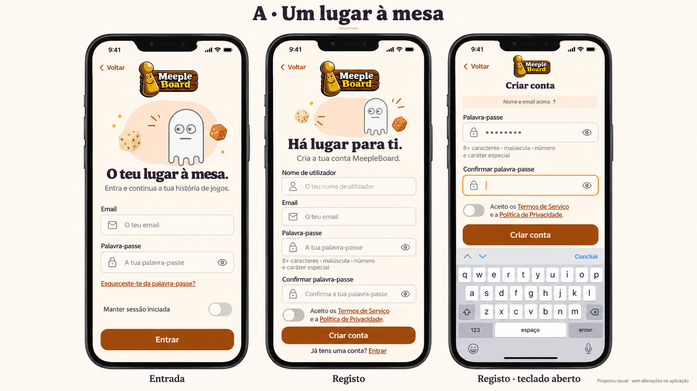
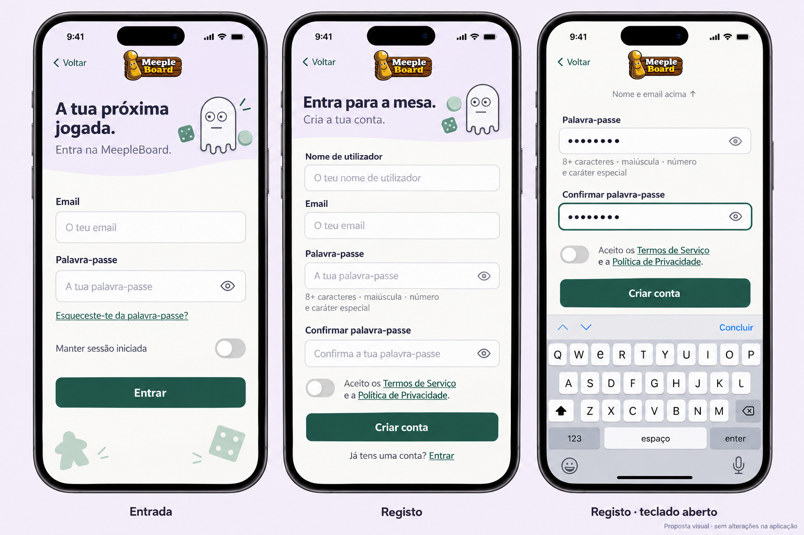

# Duas propostas visuais de autenticação

## Implementação — Clube Meeple

Direção B aprovada pelo utilizador e aplicada aos seis ecrãs: boas-vindas, Entrada, Registo, recuperação, nova palavra-passe e confirmação de email. Apenas identidade visual/composição; sem alterações a hooks, serviços, endpoints, validação, tokens ou navegação.

Paleta própria da autenticação: lavanda no cabeçalho, branco quente nos campos, verde escuro nas ações e texto ameixa. Logótipo PNG e mascote Lottie originais; o viewport remove apenas o espaço transparente do asset, sem modificar a imagem. Mascote estática no primeiro fotograma, sem animação ou decoração sobre os campos. Pequeno realce verde; sem cartões aninhados. A trouxe a continuidade da superfície e o acolhimento, sem misturar duas paletas.

Campos com rótulos permanentes, foco contrastante e altura mínima de 52 pt; tipografia de formulário 16/24, botões centrados e alvos de pelo menos 44 pt. Alturas de texto/formulário flexíveis e scroll para texto ampliado. Cabeçalho recolhe decoração com teclado aberto, altura de janela inferior a 700 ou escala de texto pelo menos 1,4. O campo focado é reposicionado depois do teclado/ajuste de layout, usando o próprio elemento nativo; a ação mantém-se na área rolável, sem sobrepor campos. Subtítulo decorativo desaparece com teclado, conteúdo dos campos permanece. Barra de estado escura sobre superfície clara, também no modo escuro do dispositivo. Listeners/timers limpos ao sair.

Preservados todos os campos e valores por defeito, mostrar/ocultar palavras-passe, autofill, mensagens, validações e proteções de saída, PT/EN, reenvio/cooldown e resultados de confirmação. Os títulos de acolhimento novos têm chaves adicionais PT/EN; as traduções anteriores foram conservadas. Requisitos da palavra-passe são mostrados com o texto de validação existente. A diferença entre regras cliente/Identity permanece registada, sem harmonização funcional nesta etapa. Os acessos/documentos mantêm as funcionalidades anteriores; nenhuma autenticação social foi acrescentada.

Validação: Node 22.14.0, TypeScript e 232 testes frontend, incluindo 24 de autenticação; contratos de pedidos, mensagens e destinos, cooldown/carregamento, foco, recolha do cabeçalho, limpeza dos listeners e contraste numérico. Bundle iOS HTTP 200 no Expo 8082, ligado à API 5099 confirmada como DeviceTests/MeepleBoard_DeviceTests/externalDelivery=false. Login e leituras de início, sessões e campanhas aprovados com as quatro contas fictícias existentes, usando o pedido de autenticação do frontend, sem imprimir palavras-passe/tokens. Exportação iOS concluída separadamente na pasta ignorada `.expo/auth-clube-ios-export`. Os testes simulados não demonstram a geometria nativa; teclado/autofill, ecrã pequeno, modo escuro e texto ampliado continuam pendentes de validação física.

Percurso inicial no iPhone: terminar sessão de teste e abrir boas-vindas → Criar conta; tentar sem campos para confirmar a mensagem; preencher, focar confirmação e mostrar/ocultar palavras-passe; experimentar texto maior e scroll até termos/ação. Cancelar e escolher continuar a editar para verificar preservação; sair deliberadamente e entrar com a conta fictícia existente. Emails reais não são usados e não se exige criar uma conta para validar o desenho. Recuperação/nova palavra-passe/confirmação mantêm os fluxos existentes, incluindo falhas de ligação.

Solo com empate/não definido e todos os resultados cooperativos continuam pendentes. Estatísticas e retrospetiva são etapas seguintes. Base habitual intacta; nenhuma migração ou alteração backend funcional nesta etapa.

Estado histórico da proposta abaixo: comparação antes da implementação; ver atualização acima. Apenas ficheiros de documentação e mockups. Nenhuma ligação à base habitual ou escrita em SQL. Dados de exemplo nos mockups são fictícios; não contêm credenciais.

## A — Um lugar à mesa

Creme, pêssego e amarelo suave; ação em laranja escuro com texto branco e texto principal escuro. Composição contínua sem cartão a envolver todo o formulário. Logótipo compacto, mascote num pequeno destaque acolhedor e título próximo dos campos. Mais calorosa e tranquila; motivos de tabuleiro discretos no cabeçalho.

## B — Clube Meeple

Lavanda e verde suave; ações em verde escuro, texto ameixa. Cabeçalho assimétrico compacto, mascote junto do título e pequenos detalhes de tabuleiro; formulário numa superfície clara contínua. Mais lúdica e gráfica, conservando a identidade original e uma só hierarquia visual.

Cada alternativa inclui Entrada, Registo e Registo com teclado aberto. Os mockups são imagens conceptuais, não prova de layout nativo ou de contraste em todos os estados. A implementação futura deve usar os assets originais, não versões desenhadas pelo gerador.

## Elementos existentes preservados

Entrada: email, palavra-passe, mostrar/ocultar palavra-passe, recuperação, manter sessão iniciada (desligado por defeito), voltar/cancelar; carregamento, mensagens de erro e reenvio de confirmação quando necessário, com limite/cooldown existentes. Não adicionar Google/Apple com base em chaves de tradução: os ecrãs atuais não apresentam esses botões.

Registo: nome de utilizador, email, palavra-passe, confirmação, mostrar/ocultar cada palavra-passe, aceitação dos Termos e Política (desligada por defeito), criar conta, acesso à Entrada e cancelar protegido. O formulário mantém a validação atual: pelo menos 8 caracteres, maiúscula, número e caráter especial; confirmar palavra-passe e aceitar termos. O DTO backend declara mínimo 6, mas a configuração efetiva Identity exige 8, maiúscula, minúscula e número, sem exigir caráter especial. Existe assim uma diferença preexistente entre a validação cliente e a configuração servidor. A proposta visual não altera nem enfraquece regras de nenhum lado; o texto de ajuda da imagem representa os requisitos atuais do formulário. Registar esta diferença para revisão funcional própria antes de uma eventual harmonização.

Autofill, teclado de email, campos de palavra-passe seguros, traduções PT/EN, normalização, submissão bloqueada durante carregamento, tokens, confirmação por email, deep links e proteções de saída mantêm-se. Novos títulos de acolhimento são propostas de texto, não alterações aplicadas.

## Teclado, leitura e acessibilidade

Cabeçalho decorativo recolhe com teclado aberto; campo focado e respetivo rótulo ficam visíveis numa área rolável, sem perder o conteúdo. A ação principal pertence ao formulário: alcançável por scroll acima do teclado, sem sobrepor campos. No Registo não se escondem nem removem campos: o exemplo mostra a zona inferior após deslocação. Fechar teclado permite voltar à página completa. Não guardar palavras-passe em persistência local por causa deste desenho.

Objetivos de implementação: campos com altura mínima 52 pt, alvos de toque pelo menos 44 pt, corpo 16 pt e rótulos permanentes; texto ampliado sem alturas fixas que cortem frases. Cores suaves nas superfícies, texto e contornos escuros. Foco e erros com mensagem, não só cor. Não depender de animação: respeitar reduzir movimento e ocultar decoração do leitor de ecrã. Verificar contraste normal, foco, erro e desativado antes de implementar; validação física com teclado, autofill e texto ampliado continua necessária.

## Restantes ecrãs de autenticação

Boas-vindas: logótipo e mascote podem ter maior presença, com Entrar e Criar conta e documentos atuais. Recuperação: cabeçalho menor, email e envio de ligação; mantém acesso à Entrada. Nova palavra-passe: dois campos seguros, regras e confirmação, sem distrair do formulário. Confirmação de email: mascote discreta, mensagem de carregamento/sucesso/erro e ações atuais para entrar, repetir ou voltar; sem alterar tokens nem validade das ligações. A usa os realces creme/pêssego, B lavanda/verde; o vocabulário, hierarquia de campos e estados repete-se em todo o conjunto.

## Etapas seguintes

B foi escolhida e implementada conforme atualização acima; confirmar primeiro no iPhone antes de avançar. Solo com empate/não definido e todos os resultados cooperativos permanecem pendentes de confirmação explícita no iPhone. Estatísticas e retrospetiva continuam nas propostas seguintes, respeitando os contratos/dados reais e privacidade. Nenhuma destas funcionalidades é implementada aqui.
